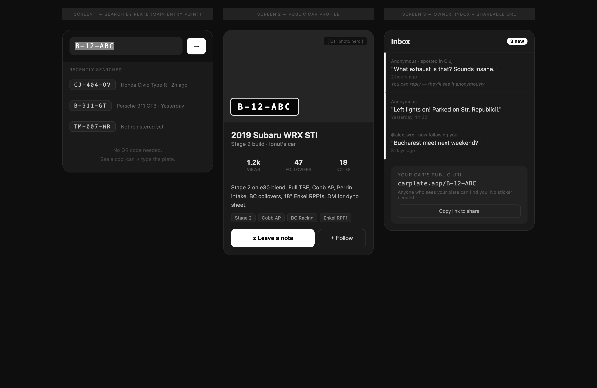
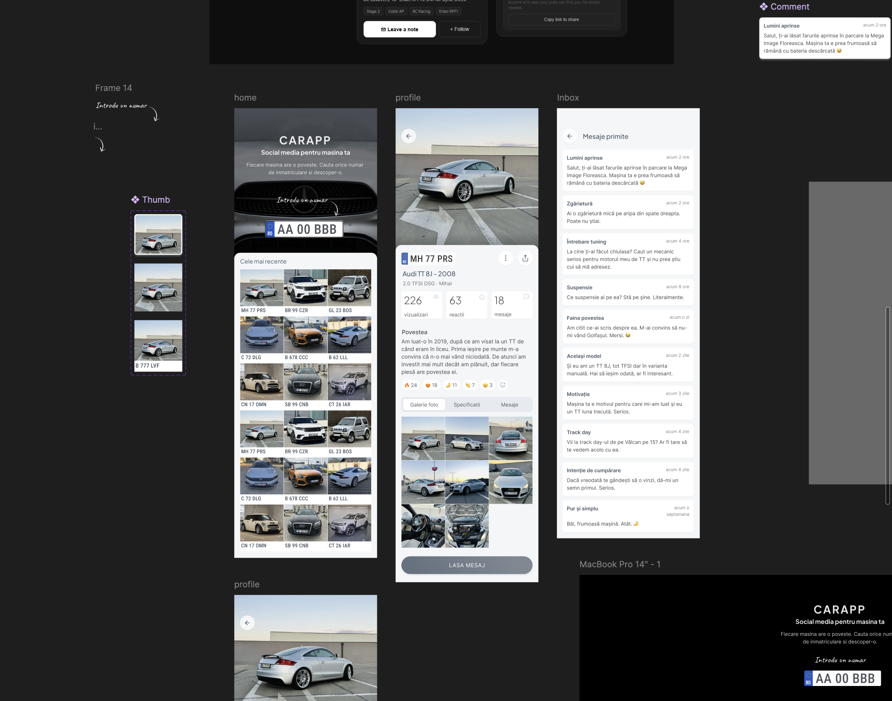
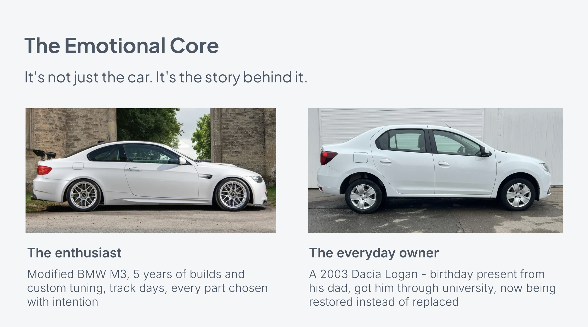
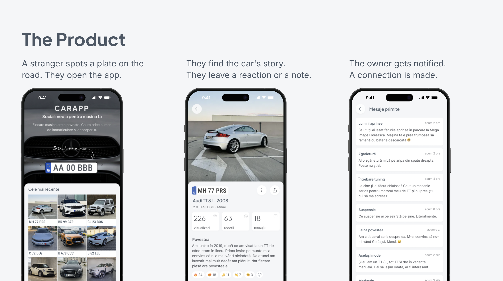

# Part 1: from idea to concept

When this took place: Apr 03 - May 03

## Preamble

I've been building commercial software products for almost 20 years, but this was always done as part of a team. Now was the perfect opportunity to do this on my own and see how far the AI hype train could take me.

Welcome to the first entry in this series where I am building a product in public, going step by step through the process from idea all the way to working product and beyond, documenting all the decisions and hurdles along the way. The product starts from a simple question:

> What if there was a better alternative to a post-it note for leaving someone a note on their car?

As of today the project is already in a solid, functional state and we're working on proving product-market fit. This series starts from day one and works forward to the present, so you can follow the whole arc. My goal in documenting it is knowledge sharing: if you find it useful or have feedback that helps me in turn, all the better.

## Background

For a long while I had this feeling gnawing at the back of my head: **_"What would it be like to work on my own product?"_**

I've worked on smaller projects on my own but they were always relegated to the hobby domain, something to do for fun or curiosity, not a product to take to market, solve a real problem, and make money with.
Back at CODE11 multiple teammates said they would have loved to work on our own product instead of client ones. I resonated with that, and the feeling grew even more after [my time at CODE11 ended](../parting-ways-with-code11/), right as AI was booming, making development more commoditized and opening doors to new possibilities.

Now that I was between jobs it was the perfect time to scratch that entrepreneurship itch and see how far building with AI could take me. The only thing I was missing was a good idea to spark the fire.
I had a couple of ideas but nothing that truly motivated me. The spark would need to come from somewhere else.

I remembered that a few years back a childhood friend of mine (we'll call him John) had wanted to pitch me his idea for a mobile app. At the time I passed. My background was in product, design and front-end. I had made a conscious decision early on to stay out of back-end even though I was familiar with using databases, API endpoints and so on. That meant I couldn't build a proper full-stack app on my own, and pulling in another developer would've added overhead I wasn't ready for. So I said no.

Nowadays though, I believed AI could fill that gap. I called John and told him I was finally ready to hear him out.

We agreed to meet for lunch back in our hometown. Even so, I went in thinking of polite ways to turn him down, worried his idea wouldn't be feasible.

## The idea

We met back in Tecuci at one of the few good restaurants we have in town. After catching up, John told me his idea. The pitch was a mobile app for drivers built around two main use cases:

1. **Leaving a message to another car owner**: like if someone parked on your spot
2. **Showing off your car**: people with fancy or customized cars, especially teenagers, feeling the need to show off their ride

This sounded like a mix of WhatsApp and Instagram, a sort of social media for cars. We talked through where the app could grow, how it would be monetized, and so on. One thing was clear: there was no such app on the market, at least not one as ubiquitous as those giants.

After we split, I kept thinking about his idea, and the more I thought about it the more I liked it. Even though I'm not a driver (in fact I'm what some drivers would consider their nemesis: a cyclist) the idea really resonated with me. I told John I was on board.

## The concept

I finally had an idea that sparked my enthusiasm. The first step was to crystallize the idea into a concept. I had recently come across a set of AI tools developed by the CEO of Y Combinator, Garry Tan: [Gstack by Garry Tan](https://github.com/garrytan/gstack). He's become something of a polarizing figure online, but his track record in the startup world is hard to argue with, and gstack is built on YC's accumulated product wisdom, which is what appealed to me, especially since I'd listened to a lot of their podcasts.

And so I installed gstack for Claude and started getting into the nitty-gritty details of defining the concept.
I started with the [/office-hours](https://github.com/garrytan/gstack/blob/main/office-hours/SKILL.md) command, which is described as:

> six forcing questions that expose demand reality, status quo, desperate specificity, narrowest wedge, observation, and future-fit.

I found this a fun and insightful process, designed to force specificity over the fuzziness that comes with product ideas. When asked for real behavioral evidence of demand, the only thing I could point to was mundane but undeniable: people leave handwritten notes with phone numbers on strangers' windshields. A subagent reviewing the session said it plainly: _"This is the only piece of real behavioral evidence in the entire session. Everything else is enthusiasm."_

Acquiring the know-how and experience of building a product end to end using AI was a goal in itself, so I was willing to take on the risks along the way, including the fact that we started from an observable fact but not much more concrete evidence. I was also confident I could ship the product in a couple of months or so which reduced the risk even further.

A point of contention was the connection mechanism: how would someone reach a car's owner in the first place? The AI suggested QR codes on the windshield. I pushed back: that felt cumbersome, and we already had a perfect identifier sitting in plain sight: the car plate. This ended up being a key insight and our narrowest wedge:

> A public profile at carapp.ro/[plate] — no app required to view. The plate is already on the car. It's already the handle. Any stranger who sees it can look it up.

When the session surfaced competitors (such as [WheelBees](https://wheelbees.com/)), a pattern jumped out. They were framing the problem the same way: use a plate to find someone, then send them a message. That's one-way, cold, and arguably a bit creepy. It only makes sense in a negative moment: when someone blocks your spot, their alarm won't stop, you get rear-ended. Plate lookup as a complaint mechanism.

What we were building inverted that entirely. The plate isn't a way to reach someone uninvited, it's their public profile. You opt in. You're not a target; you're someone who wants to be found. The car meet scenario makes this concrete: a stranger walks past your car, looks up the plate, and reaches out because they love your build. Same action, completely different emotional context.

**Everyone else built messaging tools. We were building an identity layer.**

Another thing that came out of using gstack was a set of initial wireframes, which gave the abstract concept a visual shape to react to:

_Some of the main views that would make up the app._

After more back and forth and a few adversarial review sessions using sub-agents, I ended up with a solid design document, a clear path from idea to product. The key outputs that shaped everything that came after:

#### 1. Problem statement

Car enthusiasts want to connect with other car owners they encounter in the real world, admiring a build they spotted on the road, leaving a compliment, asking about mods, or finding community. Today there's no app-native way to do this. The gap is real: people already leave handwritten notes with phone numbers on windshields to contact car owners. The behavior exists; the infrastructure doesn't.

#### 2. Status Quo

- **"I love your car, how do I reach you?"** → windshield note with a phone number. One-sided, easy to miss, and creepy for the recipient.
- **Car enthusiast community** → Facebook groups, Reddit, Instagram. Not real-world linked, no plate discovery.
- **Owner identity on the car** → Instagram sticker on the rear window. Manual, not searchable, not interactive.
- **Car meets** → show up in person. Works, but leaves no persistent connection once you drive away.

#### 3. Target user

Modified car owners who want to be discovered. They've invested in their build, they're proud of it, they go to car meets. They want strangers to find their car, ask about it, and follow it. Think: someone who would put their Instagram handle on their rear window, but would rather have a proper profile.

#### 4. Constraints

- v1 starts as a mobile PWA (Progressive Web App): Faster to ship, no App Store gatekeeping, push notifications work when installed to home screen.
- v1 has no algorithmic feed and recommendations.
- Strangers can look up any plate without downloading anything (public URL).
- Car owners create the supply side; strangers are the demand side.
- Privacy: owners must opt in to be findable. Unregistered plates show "This car hasn't joined yet; be the first to follow it" (which is also an invite mechanism).

---

Gstack had earned its keep. Not because it gave me answers, but because it forced the right questions.

Next, my plan was to make Figma mockups and a simple prototype, just to make things feel real. I had the initial wireframes as a starting point, which came with a risk: anchoring bias. I was building on top of what the AI had suggested so I was careful to treat the wireframes as a sketch, not a spec — keep what worked, throw out what didn't.

The three main screens were pretty easy to polish, with the home screen suffering the biggest change from the initial wireframe:

You can try the resulting Figma prototype for yourself here: https://www.figma.com/proto/V7ssObv94AeWimFYjHSKkY/carapp?node-id=32-1155&t=aWv099SwOpvlWygH-1

With that done, I put everything together into a simple internal presentation to show John. Not to sell him — it was his idea to begin with — but to create a shared artifact: something concrete we could both react to and align on.

While settling on the copy for the home page, I had an "aha" moment. I realized the story could be one of the crucial aspects of the app:

> Every car has a story. Search any plate and find it.

Some people might have a cool tuned sports car to show off. Others might have a plain car with a very interesting story behind it.

I remember a friend who told me how he bought his latest car, a second-hand Peugeot that his brother was originally supposed to get but passed on. He ended up with a cheap, low-consumption workhorse — not glamorous, but a clever solution to a real problem. That's exactly the kind of story I'd want to see in the app. Not just car enthusiasts. Anyone with a car and something worth saying about it.

With the emotional core in place, I finished the internal presentation, its centerpiece being the product slide:

John liked what he saw and we could both feel how things were coming together. The idea had a solid foundation, and the direction forward was clear.

What followed was the fun part: **building the thing**. Join me in the next installment to see how far one can get with just a Cursor and Claude license.
