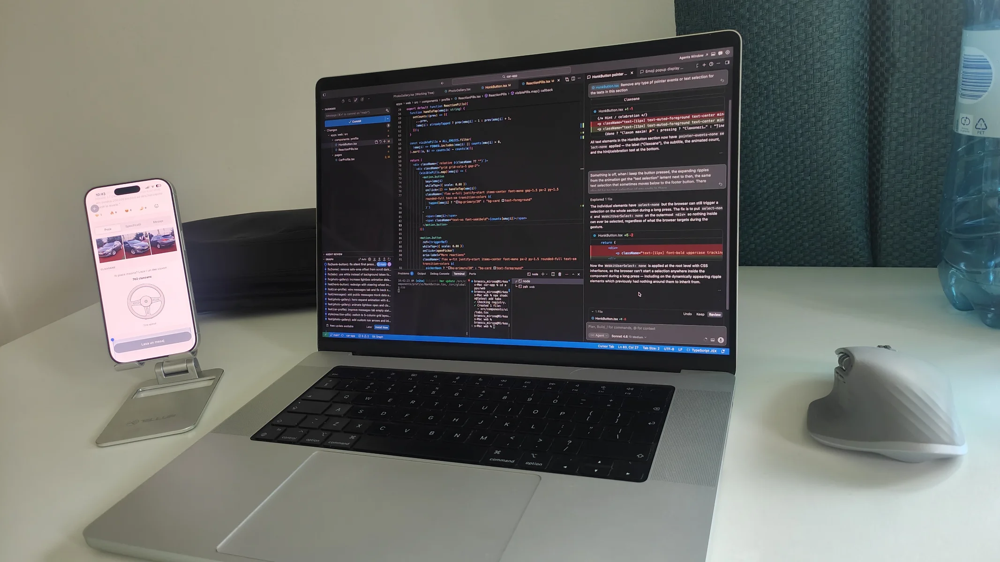
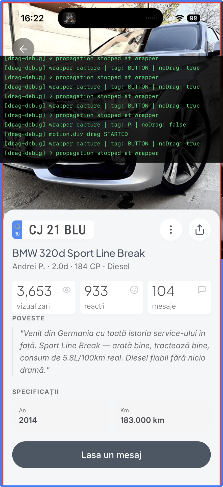
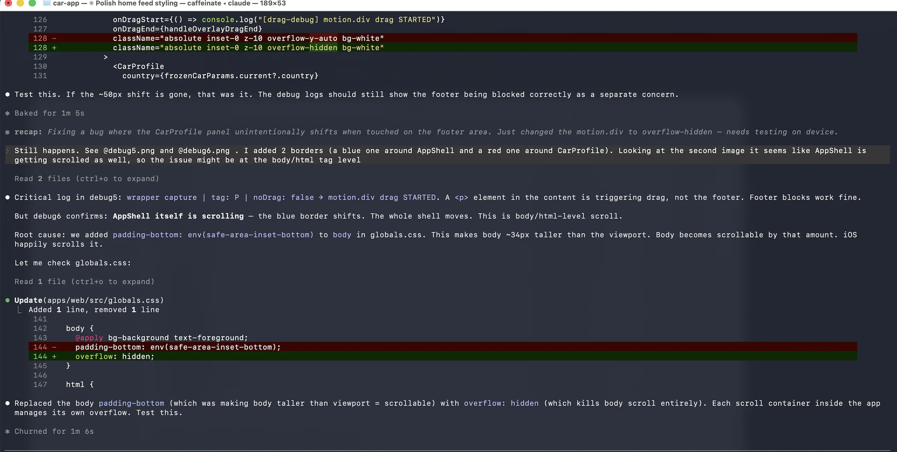
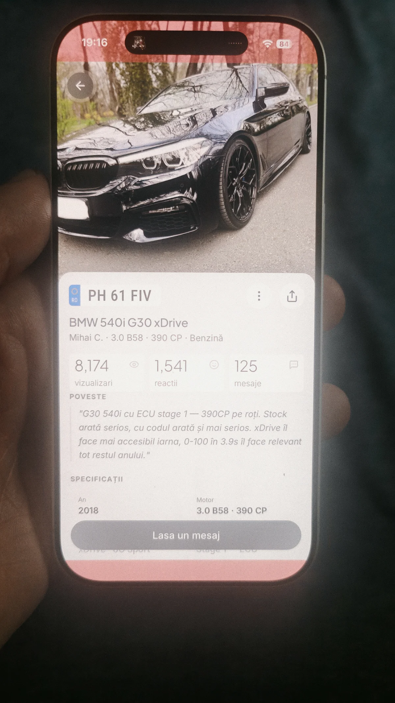
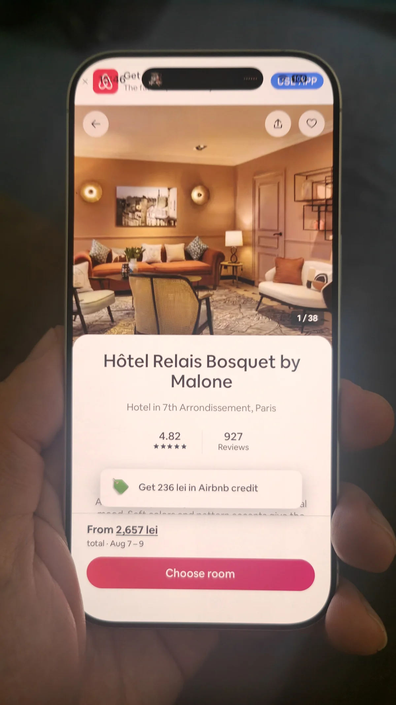
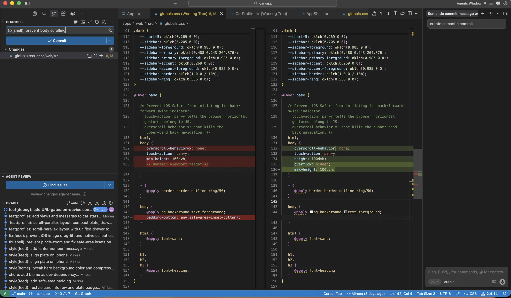
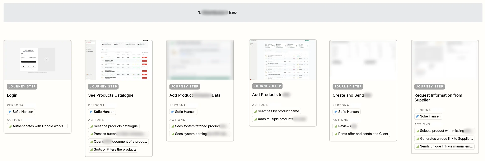

import ImageGallery from "../../../components/ImageGallery";
import DevlogStatStrip from "../../../components/charts/DevlogStatStrip.astro";
import DevlogRhythmChart from "../../../components/charts/DevlogRhythmChart.astro";
import DevlogCommitTypeBars from "../../../components/charts/DevlogCommitTypeBars.astro";
import DevlogHourHistogram from "../../../components/charts/DevlogHourHistogram.astro";

# Part 2: Just build the thing

When this took place: May 04 - Jun 04

Now that [I had a concept and initial mockups for the main screens](../building-in-public-part-1/) it was time to turn it into a product.
First, I would need to outline a plan.

I defined an initial product doc, with core info such as the narrowest wedge

> The plate-as-Car-page. `carplate.app/B-12-ABC` is a publicly accessible page. No app required to view. Anyone who sees the plate types it in. The owner has an interface for managing their Car and Owner Inbox.

Since we were in the early phases of the product, going with a PWA (Progressive Web App) instead of a native mobile app was a no-brainer:

- we could develop and deploy the app with minimal overhead instead of having to jump through hoops and loops to get our apps approved on the App Store / Google Play
- developing for web is way easier than building native apps (even with tools like [Expo](https://expo.dev/) in the market)
- we could still get a smooth and native feeling mobile app if we tweaked things right

I looked around for UI frameworks that would help me reach that native look and feel, and two candidates stood out: [Ionic](https://ionicframework.com/) and [Framework7](https://framework7.io/). There was just one issue though: they were fairly opinionated when it came to styling, and that was one area where I wanted full control: how the app looked down to each individual pixel. So I defaulted to my workhorse for the past year or two, [shadcn](https://ui.shadcn.com/), which, combined with some other libraries mentioned below, would get me that native look and feel with full styling freedom.

## Tech stack

So, after some back and forth with Claude, I ended up with this tech stack:

| Layer                             | Choice                          | Notes                                                                                                                                                                                                              |
| --------------------------------- | ------------------------------- | ------------------------------------------------------------------------------------------------------------------------------------------------------------------------------------------------------------------ |
| Frontend                          | React SPA (Vite + React Router) | Mobile-first PWA. Native feel is the top priority. Next.js rejected: SSR optimises for web, not for the in-hand app experience this product requires.                                                              |
| Localisation                      | LinguiJS (@lingui)              | Compile-time message extraction, ICU format, `.po` catalogs. Multi-language from day 1. Initial locales: Romanian (`ro`) + English (`en`). Language detected from browser locale, override stored in localStorage. |
| UI components                     | shadcn/ui                       | Radix UI primitives + Tailwind. Components live in the codebase: fully owned, no customization ceiling.                                                                                                            |
| Animations + transitions          | Framer Motion                   | Page slide transitions (AnimatePresence), micro-interactions, spring physics. This is what delivers native feel.                                                                                                   |
| Gesture handling                  | @use-gesture                    | Swipe-back, pull to refresh, drag interactions.                                                                                                                                                                    |
| Bottom sheets / drawers           | Vaul                            | Included with shadcn. Drag-to-dismiss, spring physics, feels correct on mobile.                                                                                                                                    |
| Backend / DB / Storage / Realtime | Supabase                        | Auth + Postgres + Storage + Realtime: one service covers everything needed in v1                                                                                                                                   |
| Hosting                           | Vercel                          | Auto-deploy on merge to main. Supports Vite SPA deploys.                                                                                                                                                           |
| Analytics + Error monitoring      | PostHog                         | Event tracking, funnels, session replay. Errors forwarded via a global React error boundary: no separate error monitoring service needed.                                                                          |
| Transactional email               | Resend                          | Note reply notifications, follow updates, thread expiry warnings. React Email for templates.                                                                                                                       |
| Rate limiting                     | Vercel KV                       | Serverless Redis (Upstash-backed) for IP-based counters in Vercel edge middleware. Native Vercel integration, no extra vendor account.                                                                             |
| CAPTCHA                           | Cloudflare Turnstile            | Free, usually invisible, no puzzle UX.                                                                                                                                                                             |
| Admin / moderation dashboard      | Built in React                  | Auth-gated `/admin` route, Supabase role = admin. No external tool.                                                                                                                                                |

## Running costs

| Layer                             | Tool                 | MVP (free tiers) | Production    |
| --------------------------------- | -------------------- | ---------------- | ------------- |
| Framework                         | React SPA (Vite)     | $0               | $0            |
| Backend / DB / Storage / Realtime | Supabase             | $0               | $25/month     |
| Hosting                           | Vercel               | $0               | $0            |
| Analytics + Error monitoring      | PostHog              | $0               | $0            |
| Transactional email               | Resend               | $0               | $0            |
| Rate limiting                     | Upstash Redis        | $0               | ~$0           |
| CAPTCHA                           | Cloudflare Turnstile | $0               | $0            |
| Admin / moderation                | Built in React       | $0               | $0            |
| **Total**                         |                      | **$0**           | **$25/month** |

plus the hosting via [Spaceship](https://www.spaceship.com/) which was a flat fee of $10 per year.

## Delivery plan

I settled on delivering the app in 2 phases: first I would do a fully mocked version of the app: something I could run on my phone that looked and felt real. This would let me iron out any issues in the flows, as well as build the data model bottom-up: adding props or making changes based on what I actually needed in the flows.

Phase 2 would be the "rest of the owl": hooking the app to a database, adding the auth layer, security, tests, and all the remaining back-end and infrastructure work needed to turn this into a production-ready app.

## Work setup

My setup was simple and made to work on the go. I developed the app on my Macbook, using my trusty sidekicks Claude and Cursor. I also bought a simple phone stand so I could preview and test the app on my phone while coding and prompting on the laptop.

This let me control and test every little interaction until it felt just right. It was crucial for me to get a real feel of the app in my hand, on the phone, instead of testing with a simulator in a browser window, as that would not be representative of the final thing; I would be interacting with a simulacrum.

## Off to a smooth start

The first week moved fast. I scaffolded the PWA with Vite and React, structured it into a monorepo, and wrote a scraper to pull real listings from [OLX](https://www.olx.ro/) so the mock data would feel like actual cars instead of "lorem ipsum". Within days the core of the app existed: a home feed, a full car profile with a sliding photo gallery, an owner inbox, reactions, notes, share sheets.

Nothing was wired to a real database yet, but I did create mock endpoints that simulated the backend, since this would give me a more realistic user experience. Normally when using mock data stored locally, it loads near instantly, which creates a misleading experience: real data from a server always has a slight delay. That's why I added a small forced delay to the mocked calls' responses, to get a more accurate representation of what the end user would experience.

## The first hurdle

About a week in, I ran into an issue Claude wasn't able to solve after a few tries.
I'd seen this happen with AI development many times before: the model hits a wall, and every solution it tries after that is just running in circles. So I did what I usually do in that situation: told it to take a step back, zoom out, look at things holistically, and figure out what measurements we could put in place to properly debug what was going wrong, instead of speculating about it.

The bug was an overscroll issue and so I added some colored borders around the main container for visual debugging, and Claude suggested adding a console log to show exactly which events fire:

_This is the bug in action: what should happen is that the blue area (with the back button at the top and "leave a message" button at the bottom) should remain fixed, while only the red area inside it should move._

The overscroll didn't break the app per se (both the top and bottom buttons were still usable), but it made the app feel buggy and broken, which was the opposite of what I was aiming for: smooth, solid, reliable.

With the new visual aids and debug logs in place, I was confident Claude had everything it needed to fix it. Claude seemed to think so too:

And yet the issue was still not fixed. I was shocked that despite having everything it needed, it was still unable to solve it. I was starting to think this might just be a limitation I'd have to live with.

I was fairly certain the issue was related to the safe areas you get on mobile when running a full-screen PWA, represented by the red areas in this image:

Two things pointed me there: a) it only happened when the app was installed as a PWA (full screen), not when running in a browser window; b) the scroll offset seemed to match the height of the top safe area (the top red bar in the image above).

After searching for online solutions to my problem I came across something that felt promising: [I fixed a decade-long iOS Safari problem (how to perfecly lock body scroll on iOS Safari)](https://stripearmy.medium.com/i-fixed-a-decade-long-ios-safari-problem-0d85f76caec0). Not only did this not work for my use case, but it raised all my internal alarms as it felt incredibly over-engineered with **4 wrappers** added on top of the existing content just to solve this one issue.

It was time to see how the big players dealt with it. For as long as I can remember, when it came to exemplary PWAs, one name always showed up at the top of the list: [Airbnb](https://www.airbnb.com/). I opened the URL in the browser, installed it as a PWA on my iPhone, and checked whether it had the same issue.

To my surprise, not only did it have the same bug (you could scroll the entire container out of bounds), but it didn't even fit properly on screen by default:

The top area was completely busted.

I left underwhelmed after seeing Airbnb's version, but more motivated than ever to fix the issue myself, as I wanted to make the best-feeling PWA I could, better than others on the market, including Airbnb. So I went back to basics: starting from a blank page, adding container after container and line of CSS after line of CSS until I found the element causing the issue. It took just a few minutes to find the root cause and the fix.

As so often happens in development, the solution was only a few lines long. Even though it was a relatively small issue in the grand scheme of things, this gave me the confidence that I could build a PWA that would be better in some ways than what some of the biggest names in the industry had to offer.

## Back to smooth sailing

Once that was behind me, delivery picked back up: inbox polish, empty states, the "install app as PWA" prompt, the reaction picker, another pass on the honk button. Steady, unremarkable progress, exactly what you want after dealing with an annoying bug.

## Are we there yet?

As Claude churned along nicely and the project grew and grew, I ran into a new issue: I knew the app, I knew the main flows, I could picture every single screen in my head, and yet I couldn't visualize the full picture. I could see the shape of the tail, the thick legs, the big ears and trunk, but not the whole elephant.

I needed a tool to help both the product and the development experience.
Back at CODE11, we relied on Miro, Figma, or in later years [Fibery](https://fibery.com/) (which had the benefit of being data-driven) to solve this sort of problem. Even Fibery, the best tool we ended up with to represent these sort of flows, was limited in how cards could be visually represented:

The setup we used in Fibery was better than what we had before, since it was data-driven compared to Miro, which relied on static content, but we were still limited in how the cards would look and structure the information. For example, in this case all the thumbnails are presented in a roughly 4:3 aspect ratio, while in my case, with a mobile app, I wanted the thumbnails to be much taller and easily distinguishable at a glance without needing to zoom in.

Nowadays though, I had something much better: an AI that could build whatever tool I needed.

So I started work on something I called "The Flows Visualizer": a way to visually represent the user flows in the app, the development state of each step, and all the screens and overlays that made up the interface: a tool that would be fed live data and screenshots, in a way that integrating with tools like Fibery would have been much more cumbersome to set up.

This tool would be built using [React Flow](https://reactflow.dev/), which I'd used before, and would be split into 3 main areas:

- **Use cases**: a storyboard-like representation with flows for each user, as well as cross-functional ones, giving me an overview of the flows needed to reach the desired user outcomes and letting me spot steps that were wrong or missing.
- **App map**: a tree-like structure with all the main views, their states, and overlays. This let me see which views were fully styled and ready to go and which had placeholder content, in a way acting as a measure of progress.
- **Architecture**: this showed how the pages and overlays would connect to the back-end elements. Since we started with mocked services, this was more of a placeholder in Phase 1, coming into its own in Phase 2 once we replaced mock services with real ones.

<ImageGallery
  client:visible
  images={[
    {
      src: "/building-in-public-part-2/assets/flows1-app-map.webp",
      alt: "App map",
      caption: "App map",
    },
    {
      src: "/building-in-public-part-2/assets/flows2-use-cases.webp",
      alt: "Use cases",
      caption: "Use cases",
    },
    {
      src: "/building-in-public-part-2/assets/flows3-architecture.webp",
      alt: "Architecture",
      caption: "Architecture (WIP)",
    },
  ]}
/>

The way this system worked initially: the files for pages and overlays had a sort of frontmatter containing a title, delivery status, short description, and connecting items. I also had a script that regenerated screenshots for the pages and overlays, letting me easily spot problematic or out-of-sync elements.

What started as a semi-automated process would become fully automated by the time we got to Phase 2. For now, it was enough to give me the overview I'd been missing.

## More smooth sailing

From there it was smooth again through to the end of the phase. Analytics went in so I could see what people actually touched, since I planned to hand the mocked version of the app to my mate John and a handful of other users. Every screen got localized into Romanian and English, string by string, until nothing shipped as a hardcoded literal.

Then, on June 4th (exactly one month after I'd started development), I had a mock, feature-complete version of the app, ready to hand over to a handful of people to get their first impressions and see what issues they'd run into.

## Overview of the delivery

<DevlogStatStrip
  stats={[
    { value: "25,127", label: "Lines of code" },
    { value: "454", label: "Files touched" },
    { value: "+50,966", label: "Net lines written" },
    { value: "151", label: "Components", unit: "tsx+ts" },
  ]}
/>

### Daily rhythm

**Some days, two commits. One day, forty.**
Commits per day across the full mocked build. The two-day run before the only pull request (May 17 and 18) accounts for a fifth of the entire phase.

<DevlogRhythmChart
  id="devlog-rhythm"
  legendLabel="Commits / day"
  rangeLabel="May 1 – Jun 4"
  year={2026}
  data={[
    ["05-01", 0],
    ["05-02", 0],
    ["05-03", 0],
    ["05-04", 2],
    ["05-05", 15],
    ["05-06", 25],
    ["05-07", 0],
    ["05-08", 2],
    ["05-09", 9],
    ["05-10", 0],
    ["05-11", 0],
    ["05-12", 0],
    ["05-13", 22],
    ["05-14", 2],
    ["05-15", 12],
    ["05-16", 0],
    ["05-17", 39],
    ["05-18", 40],
    ["05-19", 19],
    ["05-20", 10],
    ["05-21", 4],
    ["05-22", 10],
    ["05-23", 20],
    ["05-24", 8],
    ["05-25", 13],
    ["05-26", 18],
    ["05-27", 22],
    ["05-28", 0],
    ["05-29", 10],
    ["05-30", 13],
    ["05-31", 24],
    ["06-01", 0],
    ["06-02", 15],
    ["06-03", 12],
    ["06-04", 23],
  ]}
/>

### What got built

**Four in ten commits shipped something new.**
The rest is the invisible labor of making a mock feel real: fixes, cleanup, styling, and docs.

<DevlogCommitTypeBars
  id="devlog-bar-list"
  data={[
    ["feat", 151],
    ["fix", 86],
    ["chore", 54],
    ["style", 37],
    ["docs", 30],
    ["refactor", 19],
  ]}
/>

### When it happened

**An afternoon builder, mostly.**
Commit timestamps by hour of day. The 1pm peak is the largest single block: a lunch-to-mid-afternoon groove, with a second wind after dinner. It's almost as if these spikes coincide with Claude's 5-hour reset timer.

<DevlogHourHistogram
  id="devlog-hours"
  data={[1, 0, 0, 0, 0, 0, 0, 2, 10, 30, 18, 16, 9, 69, 12, 35, 10, 14, 34, 35, 11, 7, 3, 1]}
/>

---

Join me next time as I go through the process of defining the brand and visual identity, the hurdles that came with it, and the feedback we got for this initial mocked version.
